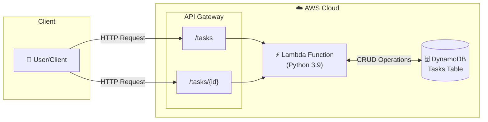

# Serverless Task API 🚀

A serverless REST API for task management built with AWS Lambda, API Gateway, and DynamoDB, deployed using Terraform.

## 📋 Project Overview

This project demonstrates a complete serverless architecture on AWS, with support for local development using LocalStack. It's the **first of four projects** in the Cloud Engineering learning portfolio.

## 🎯 What I Learned

Building this project helped me understand:

| Skill | Description |
|-------|-------------|
| **Infrastructure as Code** | Writing Terraform to define cloud resources declaratively |
| **Serverless Architecture** | Building scalable apps without managing servers |
| **AWS Services** | Lambda, API Gateway, DynamoDB, IAM, CloudWatch |
| **REST API Design** | CRUD operations, HTTP methods, status codes |
| **Local Development** | Using LocalStack to test AWS services locally |
| **Cost Optimization** | Designing within free tier limits |

## 🏗️ Architecture



## 📁 Project Structure

```
serverless-task-api/
├── README.md                 # This file
├── lambda/
│   └── src/
│       └── handler.py        # Lambda function code
├── terraform/
│   ├── main.tf               # Provider configuration
│   ├── variables.tf          # Input variables
│   ├── outputs.tf            # Output values
│   ├── dynamodb.tf           # DynamoDB table
│   ├── iam.tf                # IAM roles & policies
│   ├── lambda.tf             # Lambda function
│   ├── api_gateway.tf        # API Gateway
│   └── environments/
│       └── local/
│           └── main.tf       # LocalStack configuration
└── scripts/
    ├── deploy-aws.sh         # Deploy to AWS
    ├── deploy-local.sh       # Deploy to LocalStack
    └── destroy.sh            # Clean up resources
```

## 🚀 Deployment Options

### Option 1: Deploy to LocalStack (Free, Recommended for Testing)

LocalStack emulates AWS services locally - perfect for development and testing.

```bash
# 1. Start LocalStack
docker run -d --name localstack \
  -p 4566:4566 \
  -v /var/run/docker.sock:/var/run/docker.sock \
  localstack/localstack

# 2. Deploy
cd serverless-task-api/terraform/environments/local
terraform init
terraform apply

# 3. Test the API
curl http://localhost:4566/restapis/<API_ID>/local/_user_request_/tasks
```

### Option 2: Deploy to AWS (Free Tier)

```bash
# 1. Configure AWS CLI
aws configure

# 2. Deploy
cd serverless-task-api/terraform
terraform init
terraform apply

# 3. Test the API
curl <API_ENDPOINT>/tasks
```

## 📡 API Endpoints

| Method | Endpoint | Description |
|--------|----------|-------------|
| `GET` | `/tasks` | List all tasks |
| `GET` | `/tasks/{id}` | Get a specific task |
| `POST` | `/tasks` | Create a new task |
| `PUT` | `/tasks/{id}` | Update a task |
| `DELETE` | `/tasks/{id}` | Delete a task |

### Example Requests

```bash
# Create a task
curl -X POST $API_URL/tasks \
  -H "Content-Type: application/json" \
  -d '{"title": "Learn Terraform", "status": "in_progress"}'

# List all tasks
curl $API_URL/tasks

# Update a task
curl -X PUT $API_URL/tasks/{id} \
  -H "Content-Type: application/json" \
  -d '{"status": "completed"}'

# Delete a task
curl -X DELETE $API_URL/tasks/{id}
```

## 💰 Cost Optimization

This project is designed to run **entirely within AWS Free Tier**:

| Service | Free Tier Limit | Our Usage |
|---------|-----------------|-----------|
| Lambda | 1M requests/month | ✅ Well under |
| API Gateway | 1M calls/month | ✅ Well under |
| DynamoDB | 25 read/write units | ✅ On-demand (pay per use) |
| CloudWatch | 5GB logs | ✅ 7-day retention |

### Cost-Saving Practices Implemented

1. **On-demand DynamoDB billing** - Pay only for what you use
2. **Minimal Lambda memory** (128MB) - Lowest cost option
3. **Short log retention** (7 days) - Reduces storage costs
4. **LocalStack for development** - Zero AWS costs during dev
5. **Destroy scripts** - Easy cleanup to avoid forgotten resources

## ⚠️ Things to Be Cautious Of

| Risk | Mitigation |
|------|------------|
| **Unexpected AWS charges** | Set billing alerts, use `terraform destroy` when done |
| **Exposed API** | Currently no auth - do not store sensitive data |
| **IAM over-permissions** | Following least privilege principle |
| **State file security** | Don't commit `terraform.tfstate` to git |
| **LocalStack limitations** | Some AWS features may behave differently |

## 🧹 Cleanup

Always clean up resources when done testing:

```bash
# Destroy LocalStack resources
./scripts/destroy.sh local

# Destroy AWS resources
./scripts/destroy.sh aws

# Stop LocalStack container
docker stop localstack && docker rm localstack
```

## 🔧 Prerequisites

- [AWS CLI](https://aws.amazon.com/cli/) configured with credentials
- [Terraform](https://www.terraform.io/downloads) >= 1.0.0
- [Docker](https://www.docker.com/) (for LocalStack)
- Python 3.9+ (for local testing)

## 📚 Resources

- [Terraform AWS Provider Docs](https://registry.terraform.io/providers/hashicorp/aws/latest/docs)
- [AWS Lambda Documentation](https://docs.aws.amazon.com/lambda/)
- [LocalStack Documentation](https://docs.localstack.cloud/)
- [DynamoDB Best Practices](https://docs.aws.amazon.com/amazondynamodb/latest/developerguide/best-practices.html)

## 👤 Author

Built as part of my Cloud Engineering learning journey.

---

**This is Project 1 of 4 in the Cloud Engineering Portfolio.**

See the [main repository](../) for all projects.
